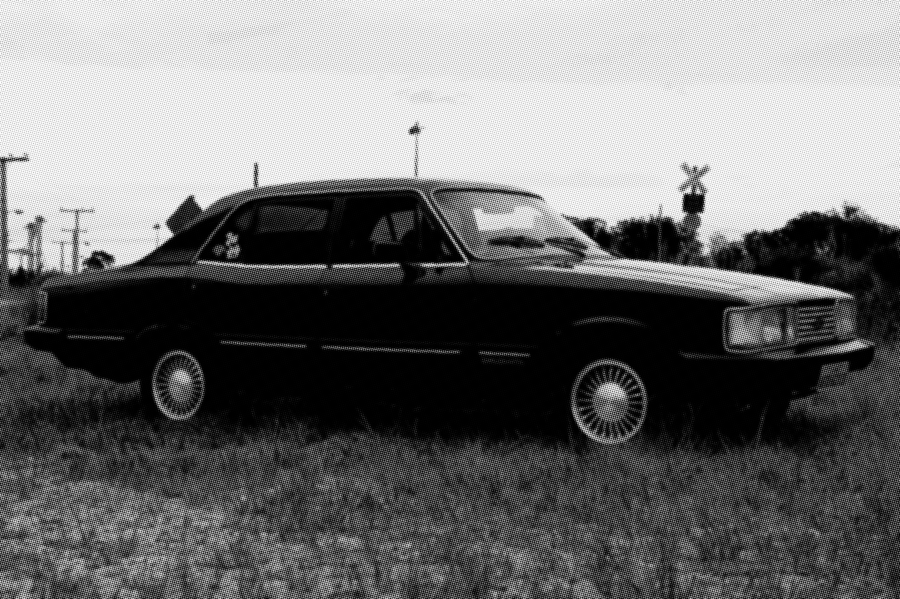

# Halftone Converter

An image converter to create high quality halftone images

## Key Features

- Easily halftone your images
- High-quality rendering using Cairo graphics library
- Halftones of 3 color types – Gray, RGB, and CMYK
- Color space transformation using ICC profiles


## Install

```sh
pip3 install halftone-converter
```

### Requirements

This application can be run from Python3 on any OS.
Note that [Pycairo requires Cairo core library](https://pycairo.readthedocs.io/en/latest/getting_started.html).

- Python >= 3.9
- NumPy >= 1.24
- Pillow >= 9.3
- Pycairo >= 1.23
- Rich >= 13.0

## Usage

### Quickstart

This application takes image files as input and outputs halftones as image files.

```sh
halftonecv INPUT.png
```

### Synopsis

The main program can be invoked either through the `halftonecv` command or through the Python main module option `python3 -m halftonecv`.
It has command line interface as shown below.

```txt
usage: halftonecv [-h] [-v] [-q] [-V] [-e] [-g]
                  [-f] [-O | -d DIR] [-P PREFIX] [-S SUFFIX]
                  [-E [START]] [-p PX] [-x SCALE] [-b [{box,gaussian}]]
                  [-B PX] [-F {nearest,linear,lanczos2,lanczos3,spline36}]
                  [-A DEG] [-t DEG DEG DEG] [-a DEG DEG DEG DEG]
                  [-m {auto,gray,rgb,cmyk}] [-o {auto,gray,rgb,cmyk}] [-T]
                  [-G GRAY_ICC_FILE] [-I RGB_ICC_FILE] [-M CMYK_ICC_FILE]
                  [-L GRAY_ICC_FILE] [-l {per,sat,rel,abs,0,1,2,3}]
                  [-R RGB_ICC_FILE] [-r {per,sat,rel,abs,0,1,2,3}]
                  [-C CMYK_ICC_FILE] [-c {per,sat,rel,abs,0,1,2,3}] [-H] [-X]
                  [--ignore] [--discard] [--opaque] [--naive] [--gamma-correction]
                  [--key RATE] [-K] [--keep-red] [--keep-green] [--keep-blue]
                  [--keep-cyan] [--keep-magenta] [--keep-yellow] [--keep-key]
                  FILE [FILE ...]
```

### Positional Arguments

#### FILE

describe input image files (required), can be multiple

Pass `-` to specify standard input.

Input images must be in a format that Pillow can read.
Also, their color mode must be Gray (L, grayscale), LA (grayscale with alpha), RGB, RGBA, P (GIF, palette based images), or CMYK.

### Optional Arguments

#### -h, --help

show the help message and exit

#### -v, --version

show program's version number and exit

#### -q, --quiet

suppress non-error messages

#### -V, --traceback

render tracebacks on error

#### -e, --exit

stop the program immediately by an error even if jobs remain

By default, it skips failed jobs (corrupted images, etc.) and starts the next one.

#### -g, --glob

interpret `FILE` values as glob patterns (e.g., `*.png`, `**/*.jpg`)

Use this option if the shell's wildcard expansion is not available and enough.
Pattern `**` matches any files and zero or more directories recursively.
This glob function will NOT include hidden files or directories.

#### -f, --force

overwrite existing files by outputs

By default, an alternate filename will be used if the original filename conflicts.

#### -O, --stdout

send output to standard output

Only one image can be input when using this option.

#### -d DIR, --directory DIR

save output images in `DIR` directory

The directory will be created automatically if it does not exist.

#### -P PREFIX, --prefix PREFIX

specify a prefix string of output filenames

#### -S SUFFIX, --suffix SUFFIX

specify a suffix string of output filenames

#### -E [START], --enumerate [START]

use consecutive numbers as output filenames

It counts up by one from `START`.
The default `START` is 1.

#### -p PX, --pitch PX, --interval PX

arrange halftone dots at intervals of `PX` pixels in input images

Change this value for desired results.
The default value is 4.0.

#### -x SCALE, -s SCALE, --scale SCALE

the scale factor of output images to input images

The default value is 1.0.

#### -b [{box,gaussian}], --blur [{box,gaussian}]

apply blur effect to source images

If no blur type is specified, gaussian is used.

#### -B PX, --blur-radius PX

specify blur radius

If not specified, half of the pitch is used.

#### -F {nearest,linear,lanczos2,lanczos3,spline36}, --resample {nearest,linear,lanczos2,lanczos3,spline36}

resampling method for determining dot size

The default is `linear`.

#### -A DEG, --angle DEG, --gray-angle DEG

arrange dots by `DEG` degrees in Gray channel

#### -t DEG DEG DEG, --Angles DEG DEG DEG, --rgb-angles DEG DEG DEG

arrange dots by `DEG` degrees in each RGB channels respectively

#### -a DEG DEG DEG DEG, --angles DEG DEG DEG DEG, --cmyk-angles DEG DEG DEG DEG

arrange dots by `DEG` degrees in each CMYK channels respectively

#### -m {auto,gray,rgb,cmyk}, --mode {auto,gray,rgb,cmyk}

color space type to generate halftones

The default is `auto`.
It means that Gray images will be Gray halftones, and colored images will be CMYK halftones.

#### -o {auto,gray,rgb,cmyk}, --output {auto,gray,rgb,cmyk}

color space type to save output images

The default is `auto`.
It means that Gray images will be saved as Gray images, and colored images will be saved as RGB images.

#### -T, --tiff, --out-tiff

save TIFF images instead of PNG images

CMYK images will always be saved in TIFF regardless of this option.

#### -G GRAY_ICC_FILE, --input-gray-profile GRAY_ICC_FILE

specify ICC profile for input Gray images

#### -I RGB_ICC_FILE, --input-rgb-profile RGB_ICC_FILE

specify ICC profile for input RGB images

#### -M CMYK_ICC_FILE, --input-cmyk-profile CMYK_ICC_FILE

specify ICC profile for input CMYK images

#### -L GRAY_ICC_FILE, --gray-profile GRAY_ICC_FILE

specify ICC profile for transform to Gray images

#### -l {per,sat,rel,abs,0,1,2,3}, --gray-intent {per,sat,rel,abs,0,1,2,3}

rendering intent for transform to Gray images

#### -R RGB_ICC_FILE, --rgb-profile RGB_ICC_FILE

specify ICC profile for transform to RGB images

#### -r {per,sat,rel,abs,0,1,2,3}, --rgb-intent {per,sat,rel,abs,0,1,2,3}

rendering intent for transform to RGB images

#### -C CMYK_ICC_FILE, --cmyk-profile CMYK_ICC_FILE

specify ICC profile for transform to CMYK images

#### -c {per,sat,rel,abs,0,1,2,3}, --cmyk-intent {per,sat,rel,abs,0,1,2,3}

rendering intent for transform to CMYK images

#### -H, --allow-huge

disable the limitation of input image size

Be careful in the context of server-side applications.
This option may make DoS attacks possible (Decompression bomb).

#### -X, --orientation

apply Exif orientation

#### --ignore, --ignore-embedded-profile

don't respect ICC profiles embedded in input images

#### --discard, --discard-profile

don't embed ICC profiles in output images

#### --opaque, --discard-alpha

drop alpha channel from output

#### --naive, --naive-transform

use approximate color space conversion algorithm (naive transform) instead of ICC profile-based transform

#### --gamma-correction

apply sRGB gamma correction for RGB-CMYK conversion when the naive transform is used

#### --key RATE, --key-from RATE

black ingredient threshold within 0.0-1.0 for RGB-CMYK conversion when the naive transform is used

#### -K, --keep-all

don't convert any channels to halftones

This is useful for previewing color space transformation.

#### --keep-red

don't convert R channels to halftones

#### --keep-green

don't convert G channels to halftones

#### --keep-blue

don't convert B channels to halftones

#### --keep-cyan

don't convert C channels to halftones

#### --keep-magenta

don't convert M channels to halftones

#### --keep-yellow

don't convert Y channels to halftones

#### --keep-key

don't convert K channels to halftones

## Gallery

### RGB


### CMYK


### CMYK (Japan Color 2011 Coated)

Example with user's custom ICC profile


### Gray



## Acknowledgments

This application contains some default ICC profiles to convert images between different color spaces.
`sGray.icc`, `sRGB.icc` and `SWOP.icc` are provided by Artifex Software as a part of [GPL Ghostscript](https://www.ghostscript.com/) under the [GNU Affero General Public License v3.0](https://www.gnu.org/licenses/agpl-3.0.html).

## License

GNU Affero General Public License v3.0
